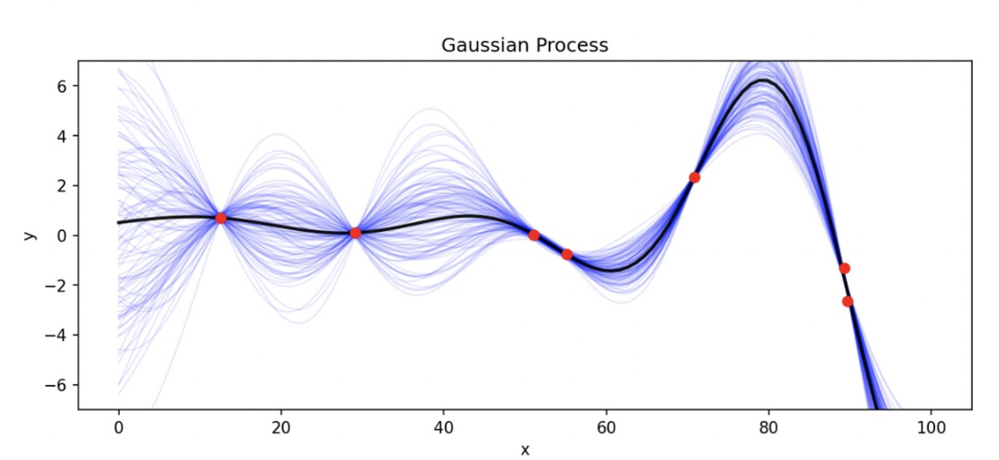
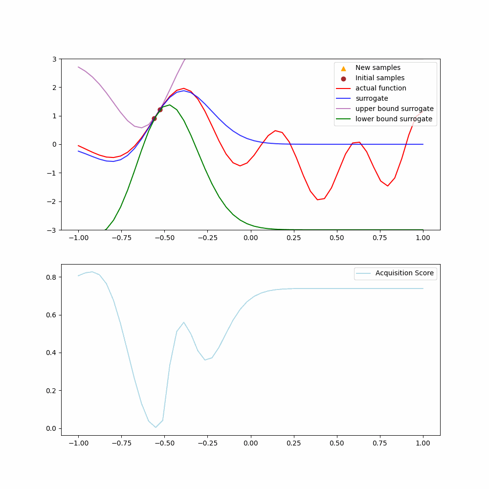
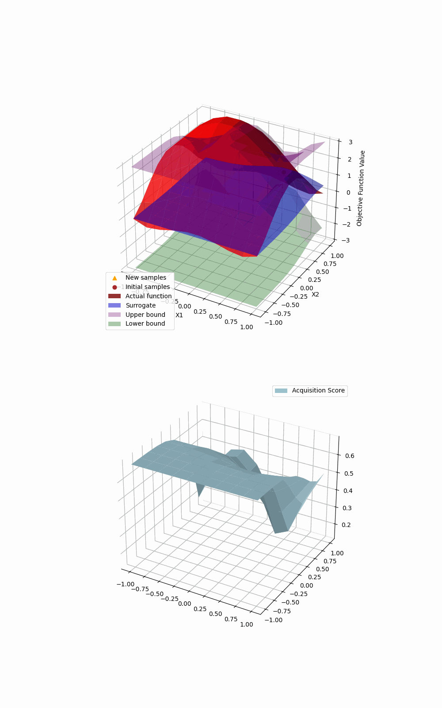

# Bayesian Optimization 📉

# 


# 

In this post, I present the Bayesian Optimization algorithm, explain why it is so useful and share my implementation of it.
* * *
## 📰 Quick presentation of the tool

* * *

It is an optimization algorithm that works by iteratively approximating the objective function by a set of candidates functions (that look like multimodal gaussians) .

It requires very few assumptions on the objective function and it is designed to achieve high efficiency for objective functions with a low dimension domain but with a large evaluation complexity.

* * *
## 🔬Details on the tool

* * *

### Step by step

At the beginning of the algorithm, the points to evaluate are drawn randomly in the domain of the objective function $f$, with an arbitrary prior.

At each step, given the known values of the function, a gaussian process model is fitted, which corresponds to a distribution guess of the possible values that **$f(x)$** can take, at points where $f$ has not been evaluated yet.



The shape of the distribution is controlled by the kernel of the gaussian process model, which can allow high variations, or can enforce the estimate to be smoother to avoid overfitting a noisy objective function

Given these distributions, the zone where to sample $f$ on the next step is determine. Both the lack of information about a zone and the performance of the last points are taken into account. each point of the domain is granted an “acquisition score”, given an arbitrary method that should strike ablaance between the exploration (visit the least visited zones) and the performance (visit the zones where the estimate of $f$ is maximized)

Here is the pseudo code:

```
Parameters: 
    - s, the size of the initial draw 
    - the number of generations
    - an objective function f
    - an acquisition function u (that determines where to draw the next samples)
    - k the hyperparameter that controls the confidence level used for the acquisition function
                (if 0, the acquisition uses only the mean predicted, 
                else, the bigger k is the more it values exploration (larger confidence intervals))
    - model: a Random Process Regressor model.
    - bounds for f [[min_x1,max1],...,[min_x,maxn]] where n is the dimension of the domain
    - a prior on how to draw the first samples 
    
Initialization: 
    - Make a initializing draw X (s samples) with the prior
    - Evaluate y=f(X)
    - Store them to arrays Lx and Ly
    - Initialize the surrogate (estimate) objective function to default arbitrary weights
    

Repeat for the number of generations:
    - given Lx and Ly, and a random search on the acquisition function u, 
                find the where to sample x_next within the bounds
    - Evaluate y_next=f(x_next)
    - Add them to arrays Lx and Ly
    - Fit the surrogate objective function to Lx and Ly

Returns:
    - the surrogate objective function
    - the arrays Lx and Ly
```

### What acquisition functions to choose ?

An acquisition function should only take as an input the current distribution estimates of the functions values. A simple way is to value the zones of the domain where the estimate $\mu (x)$ is high, but the score should also be high if the estimate is uncertain.

Here is a list of common acquisition functions:

$$\text{USB (Upper Confidence Bound), the most optimistic}
 \\
    Score: USB(x) = \mu(x) + k \sigma (x) 
 \\
 \text{ Here } \mu (x) \text{ is the mean prediction from the model at point } x, 
 \\  \sigma (x) \text{ is the standard deviation of the prediction at point } x,  
 \\ k \text{ is a trade-off parameter that balances exploration and exploitation.} \\ $$


$$\text{LSB (Lower Confidence Bound), similar, but pessimistic }
 \\
    Score: LSB(x) = \mu(x) - k \sigma (x)$$

$$\text{PI: Probability Improvement}  
 \\  
 \text{This acquisition function measures the probability  that the function value } \\ \text{at a given point  is better than the current best known function value plus a margin of } k \\
    Score: PI(x) = P(f(x) + k \cdot \sigma (x))=  \Phi(-\frac{f(x_{best}) + k - \mu(x)}{\sigma(x)})   
 \\  
\Phi \text{ is the normal cumulative distribution function}$$

$$
\\ 
\text{EI: Expected Improvement}  
 \\  
 \text{This acquisition function measures the expected improvement  } \\ \text{at a given point } x \\
    Score: EI(x) = (\mu(x) - f(x_{best}) - k)\Phi(\frac{\mu(x) - f(x_{best}) - k}{\sigma(x)})\\
$$
* * *
## 👨‍💻My implementation [(Source Code)](https://github.com/Hadrien-Cr/Discover-Implement-Repeat/tree/main/Optimization/BAYESIAN_OPT)

* * *

I implement the algorithm presented in the previous section.

For the Random Process model, I started with the [GaussianProcessRegressor](https://scikit-learn.org/stable/modules/generated/sklearn.gaussian_process.GaussianProcessRegressor.html#rf75674b0f418-rw2006) from scikit-learn, then I got inspired by chapter 2 of [Gaussian Processes for Machine Learning](https://gaussianprocess.org/gpml/chapters/RW.pdf) and built my custom version

Here is the pseudo code on how to fit and predict with a Gaussian Process Regressor:

```python
Regressor:

-------------------------------------------

    Args: k (kernel:k(.,.,theta) where theta is an hyperparameter ),σ^2 (noise level)
        
-------------------------------------------

    Fit method :
   Args: X (training inputs), y (training targets)
      Repeat with different values of theta, searching to minimize log_marginal_likelihood:
       - Compute L = cholesky(K(X,X,theta) + σ^2 I) 
       - Compute α = L^T\(L\y)  
       - Compute the log_marginal_likelihood log p(y|X) =-(1/2)y^Tα-sum(Lii)-(n/2) log(2pi) 
      Store: X,L,α, theta
      
    -------------------------------------------
    
    Predict method:
        Args:  X_test (test inputs)
            # the estimate at the given points X_test
            - f(X_test) = k(X,X_test,theta)^T α 
        - v := L\k(X,X_test,theta)
        # variance of the estimate at the given points X_test
        - V(f)(X_test)= k(X_test,X_test,theta) -v^Tv 
      Return f(X_test),V(f)(X_test) 
```

My custom random regressor ended being way slower than the one from scikit-learn, especially for the predicting step.
* * *
## 👀Visualizing the search

* * *

Search in a 1-dimensional domain, with kernel RBF(0.2), k = 0.1, acquisition function EI:



the upper and lower bounds form a 99% confidence interval on the surrogate function

Search in a 2-dimensional domain, with kernel RBF(0.5), k = 0.1, acquisition function EI:

